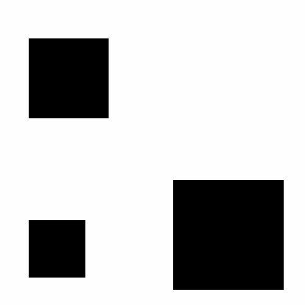

 

Vault256

  <strong>The Monolithic Security Standard for Local Data Isolation.</strong> 
  <em>Because if your data is on the cloud, it’s not a vault—it’s a guest room.</em>

---

## 🛡️ The Fortress Philosophy
**Vault256** is a high-integrity cryptographic isolation chamber. Unlike cloud storage providers that prioritize "syncing" and "sharing," Vault256 focuses on **Zero-Trust Locality**. It is designed to turn your local hardware into a digital lead-lined box, ensuring that sensitive assets remain immutable and invisible to unauthorized processes.

### Why "256"?
The "256" prefix represents our **Encryption Standards**:
* **Single-Point Entry:** No external APIs, no telemetry, no "phone home" loops.
* **Monolithic State:** The vault operates as a single, hardened binary environment to minimize the attack surface.
* **Absolute Ownership:** You hold the keys, the entropy, and the physical storage.

---

## ⚙️ Technical Specifications

| Feature | Implementation | Security Benefit |
| :--- | :--- | :--- |
| **Encryption** | $AES-256-GCM$ | Authenticated encryption that ensures data hasn't been tampered with. |
| **Key Derivation** | $Argon2id$ | Best-in-class resistance against GPU/ASIC brute-force attacks. |
| **Memory Hardness** | Configurable Salt/Parallelism | Prevents side-channel leaks during the unlocking process. |
| **Data Handling** | Volatile Buffer Clearing | Cryptographic material is wiped from RAM immediately after use. |

---

## 🚀 Verdict

Vault256 is built for everyone who prefer 3Ps: Privacy, Protection, Performance in one platform.
It is completely free of cost and only additional scaling comes with a freemium model.
